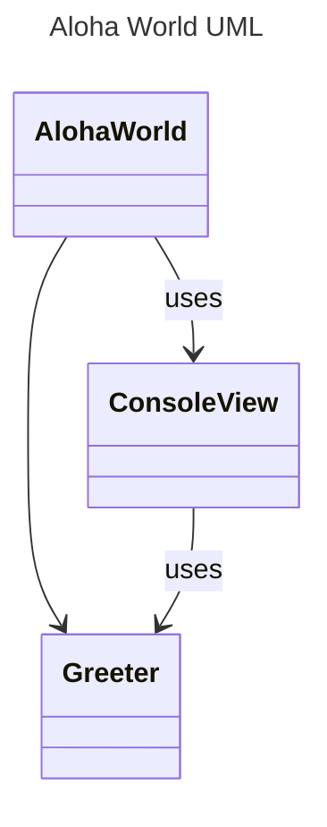

# Aloha World Homework Instructions

Aloha! This assignment is meant to give you an introduction to the java programming language and object oriented design. The assignment is to debug the provided java application, and then add a new java object from scratch giving you both the experience of a working java program, and writing a file from scratch. Overall, the goal is for you to learn the homework submission process, and get a feel for the java programming language.

## Table of Contents
- [Aloha World Homework Instructions](#aloha-world-homework-instructions)
  - [Table of Contents](#table-of-contents)
  - [Learning Objectives](#learning-objectives)
  - [Javadoc](#javadoc)
  - [Assumptions](#assumptions)
  - [Instructions](#instructions)
    - [Part 1: Cloning Your Repository into your IDE](#part-1-cloning-your-repository-into-your-ide)
      - [Part 1.1: Updating the README.md](#part-11-updating-the-readmemd)
    - [Part 2: Design Documentation](#part-2-design-documentation)
    - [Part 3: Debugging the Aloha World Application](#part-3-debugging-the-aloha-world-application)
      - [Part 2.1: Building with Gradle](#part-21-building-with-gradle)


## Learning Objectives

* Learn how to debug a java application along with basic java syntax
* Learn how to write a single java class 
* Practice testing using JUnit tests
* Be able to answer some introductory questions about java syntax and object oriented design
* Write a UML diagram for a java application
* Learn about git and github 
* Learn how to use gradescope combined with github for homework submission
* Learn markdown syntax used for reports and README files for homework assignments
* Learn basic mermaid syntax used for drawing diagrams in markdown

An observant reader will notice that many of the learning objectives have very little to do with the code itself. This is intentional. The goal of this assignment is to get you comfortable with the homework submission process, and to get your "ecosystem" setup for this class. Just as importantly, this classes focuses heavily on industrial practices, and we want to get you comfortable with the tools you will be using in the industry. Github and Markdown are both tools heavily used in industry, so we will be using for all our assignments. 

## Javadoc


* [javadoc] - This is the link to your javadoc for any code we provide. We will have javadoc for all code we provide, so you can also get an easier understanding of what the code does.


## Assumptions

This homework assumes you have installed your favorite IDE (IntelliJ or VS Code) and installed the recommended plugins or extension as listed in the [5004 Resources](https://github.com/CS5004-khoury-lionelle/Resources) repository. Additionally, you will need to make sure gradle and java are installed. You can confirm they are installed by going to the command line and typing `java -version` and `gradle -version`. If you get a version number, you are good to go. If you get an error, you will need to install them or check your environment variables.

You should have also clicked on the link in the Canvas assignment shell to generate your github repo from the github classroom. As a reminder, you need a Github.com account! Don't use the Khoury Github Enterprise account, as it will not work with github classroom. 


## Instructions

This assignment is broken up into multiple parts. Remember, it is a two week assignment that will take **TIME** to complete! Do not delay getting it started, even if you have to take breaks and come back to it. Throughout the semester, we will be adding more and more to the assignments, so it is important to get a good start on them.


### Part 1: Cloning Your Repository into your IDE

After your starter repository is created, you will need to clone it into your IDE. To find your code, go to the github repository that was created for you, and find the green "Code" button. Click on it, and then copy the URL that is shown.

Here is a screenshot, though the graphics change from time to time, so it may not be exact.


Then go into your IDE, and find the clone repository (or get from version control) option. For IntelliJ IDEA, it looks like the following:


For VS Code, it looks like the following:

 

Note: if git is not installed on your computer, you won't see the option to clone from version control. You will need to install git on your computer.

In both cases, use the URL copied from the github repository to clone the repository into your IDE. 


#### Part 1.1: Updating the README.md

For this class, you end up submitting your homework by checking in your entire github repository, and then submitting to gradescope. You have to submit every time you want the autograder to run, so don't forget. 

In the main directory of your repository, you will find a file called [`README.md`](../README.md). This file is a markdown file that is used to describe your repository. You should update this file with your name, github account name, and the link to your repository. 

After you do this update, follow the steps in your IDE to commit your changes, and push to github. 

Take a look at your repository on github to make sure the changes are there.

> [!IMPORTANT]
> After every major change to your code and every major step (such as completing part 1), you should commit and push to the repository.


### Part 2: Design Documentation

Before you code, every programmer must first:

1. Understand the provided code given to them
2. Design the code they are going to write

While this assignment focuses on reading code, we will still have you build the UML design chart for the program. To do this, you must first understand the code you are given by taking time to read through the code and read the [javadoc].

The javadoc is generated by the particular commenting in the files themselves. The `/** */` comments are used to generate the javadoc. It is a built in documentation system that is even used by the java standard library. Take a look at the files for AlohaWorld, ConsoleView, and Greeter to understand what the code does.

> [!NOTE]
> Each javadoc page has `Methods inherited from class Object`, you can ignore this section. As you learn more about inheritance in the coming weeks, you will find out that all classes in Java inherit from the `Object` class creating some methods that are used by java internally.


You will also notice that anything listed as `private` in the file, doesn't show up in the javadoc. That is intentional, as often only things accessible from outside the class show up in documentation. We are pointing this out now, as it is important to understand what is and isn't documented in the javadoc when you work on your assignments. 


Using the javadoc, and your understanding of the code, create a UML diagram for the Aloha World application. You can use any UML tool you like such as [draw.io](https://app.diagrams.net/). However, you are also free to use [Mermaid markdown] to create the UML diagram. If you do this, include the mermaid code in the [Report.md](../Report.md) file.

To help you out, here is the starting UML diagram for the Aloha World application. You will need to add in the internals of each class. In your UML, you should include the private functions and variables as well using the `-` symbol before them. 



> [!NOTE] 
> In the above diagram, we introduce an additional notation from your module video - `uses`. It is used to show that one class uses another class but doesn't create the object. So if you look at the diagram, you can see that `AlohaWorld` uses  `ConsoleView` by calling the static methods. However, AlohaWorld has the line ` Greeter greeter = new Greeter(name, locality);` which create a new Greeter object. As such, it is the *has a* relationship, as AlohaWorld has a Greeter (the default when the arrow goes that way).


Additionally in [Report.md](../Report.md), write a paragraph that details the 'flow' of the application. For example, the program starts in main() in AlohaWorld which then asks the client for their name and location...


As always, don't forget to commit and push your changes to github after you have completed this part of the assignment.

### Part 3: Debugging the Aloha World Application

For the next part of this assignment, you will debug the provided code. Spoiler, it doesn't compile as is! You will need to first find the compile errors and fix them.

#### Part 2.1: Building with Gradle
To first compile your code, let's look at the gradle commands you can use. Inside your IDE, you can use the terminal to run gradle commands directly. 

To compile your code, you can use the following command:

```bash
./gradlew build
```

or in windows

```bash
./gradlew.bat build
```

This will attempt to compile your code.  You an also attempt to compile your code using the IDE. In VS Code, this looks like a small `[run]` above the `main` method. In IntelliJ, it looks like a green play button.


<!-- links -->
[javadoc]: https://cs5004-khoury-lionelle.github.io/hello_world/student/package-summary.html 
[mermaid markdown]: https://mermaid.js.org/syntax/classDiagram.html