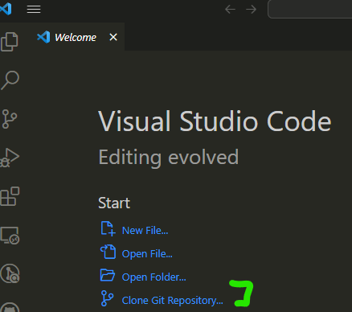

# Aloha World Homework Instructions

Aloha! This assignment is meant to give you an introduction to the java programming language and object oriented design. The assignment is to debug the provided java application, and then add a new java object from scratch giving you both the experience of a working java program, and writing a file from scratch. Overall, the goal is for you to learn the homework submission process, and get a feel for the java programming language.

## Learning Objectives

* Learn how to debug a java application along with basic java syntax
* Learn how to write a single java class 
* Practice testing using JUnit tests
* Be able to answer some introductory questions about java syntax and object oriented design
* Write a UML diagram for a java application
* Learn about git and github 
* Learn how to use gradescope combined with github for homework submission
* Learn markdown syntax used for reports and README files for homework assignments
* Learn basic mermaid syntax used for drawing diagrams in markdown

An observant reader will notice that many of the learning objectives have very little to do with the code itself. This is intentional. The goal of this assignment is to get you comfortable with the homework submission process, and to get your "ecosystem" setup for this class. Just as importantly, this classes focuses heavily on industrial practices, and we want to get you comfortable with the tools you will be using in the industry. Github and Markdown are both tools heavily used in industry, so we will be using for all our assignments. 

## Assumptions

This homework assumes you have installed your favorite IDE (IntelliJ or VS Code) and installed the recommended plugins or extension as listed in the [5004 Resources](https://github.com/CS5004-khoury-lionelle/Resources) repository.

You should have also clicked on the link in the Canvas assignment shell to generate your github repo from the github classroom. As a reminder, you need a Github.com account! Don't use the Khoury Github Enterprise account, as it will not work with github classroom. 

## Instructions

This assignment is broken up into multiple parts. Remember, it is a two week assignment that will take **TIME** to complete! Do not delay getting it started, even if you have to take breaks and come back to it. Throughout the semester, we will be adding more and more to the assignments, so it is important to get a good start on them.

### Part 1: Cloning Your Repository into your IDE

After your starter repository is created, you will need to clone it into your IDE. To find your code, go to the github repository that was created for you, and find the green "Code" button. Click on it, and then copy the URL that is shown.

Here is a screenshot, though the graphics change from time to time, so it may not be exact.

Then go into your IDE, and find the clone repository (or get from version control) option. For IntelliJ IDEA, it looks like the following:

For VS Code, it looks like the following:

 

Note: if git is not installed on your computer, you won't see the option to clone from version control. You will need to install git on your computer.

In both cases, use the URL copied from the github repository to clone the repository into your IDE. 

#### Part 1.1: Updating the README.md
